# SMS — SimMathsSciences

Simulations interactives de **mathématiques** et **sciences** pour les filières **CAP**, **Bac Pro** (2BP, 1BP, Term BP) et **3PM**.

Chaque simulation est un fichier HTML autonome (aucune dépendance, fonctionne hors-ligne dans le navigateur).

## 🔬 Sciences

| Simulation | Niveau |
|---|---|
| [Chimie CAP](./CAP_Chimie-A/Chimie%20CAP.html) | 1CAP — Chimie (échelle de l'univers, molécule, sécurité chimique, granulaire) |
| [Chimie — pH](./GOOD_sciences-tbp-Chimie_pH-TermBP_Sc_ChimiePh_Sim.html) | Term BP — Chimie |
| [Chimie — Synthèses organiques](./GOOD_sciences-tbp-Chimie_syntheses_organiques-TermBP_Sc_ChimieSynthesesOrganiques_Sim.html) | Term BP — Chimie |

## 🧮 Mathématiques

| Simulation | Niveau |
|---|---|
| [SPEEDMATH — Automatismes](./GOOD_1CAP-Automatismes_SPEEDMATH_G_Qwen_html_20260823_oy6e7l0fk.html) | 1CAP |
| [Statistique](./GOOD_CAP-Maths-Statistique04_Qwen_html_20260814_k5c3fbtm2.html) | CAP |
| [Dérivation](./GOOD_1iere-Term-Bacpro_Maths_Dérivation_Qwen_html_20260825_a8lhlvlxk.html) | 1ère / Term BP |
| [Fonctions — Lecture graphique](./GOOD_maths-1bp-Fonctions-1BP_Fonction-LectureGraph-Im-Ant.html) | 1BP |
| [EquaQuest — Résolution d'équations](./GOOD_maths-2bp-Agèbre-EquaQuest.html) | 2BP |
| [Fonctions — Chute libre](./GOOD_maths-2bp-Fonctions_Chute-libre_association.html) | 2BP |
| [Fonctions — Algèbre](./GOOD_maths-2bp-Fonctions_Partie2_Algèbre_Im-Ant.html) | 2BP |
| [Statistique à une variable](./GOOD_maths-2bp-Statistique_a_une_variable-2BP_Ma_StatistiqueVariable_Sim.html) | 2BP |
| [Probabilités — Fluctuations d'échantillonnage](./GOOD_Maths-seconde-Probabilité-fluctuations-freq_D-Qwen_html_20260819_fzlixhi6x.html) | Seconde BP |
| [Probabilités — Convergence](./GOOD_Seconde-Maths-proba-convergence-C_Qwen_html_20260819_neq1lg8tv.html) | Seconde BP |

## 🧰 Outils

| Outil | Description |
|---|---|
| [Boulier](./GOOD_Boulier_Qwen_html_20260806_6233pw4k3.html) | Boulier interactif |
| [Règle à calcul (1)](./GOOD_Règle-à-Calcul-01_Qwen_html_20260810_rvwjycrfd.html) | Règle à calcul |
| [Règle à calcul (2)](./Règle-à-Calcul-02_Qwen_html_20260810_sk2f4gf9b.html) | Règle à calcul |
